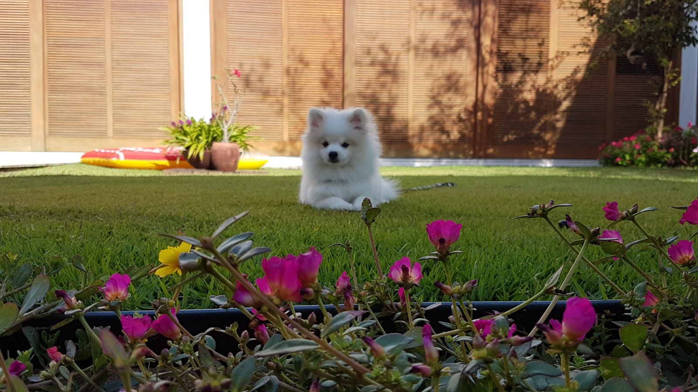
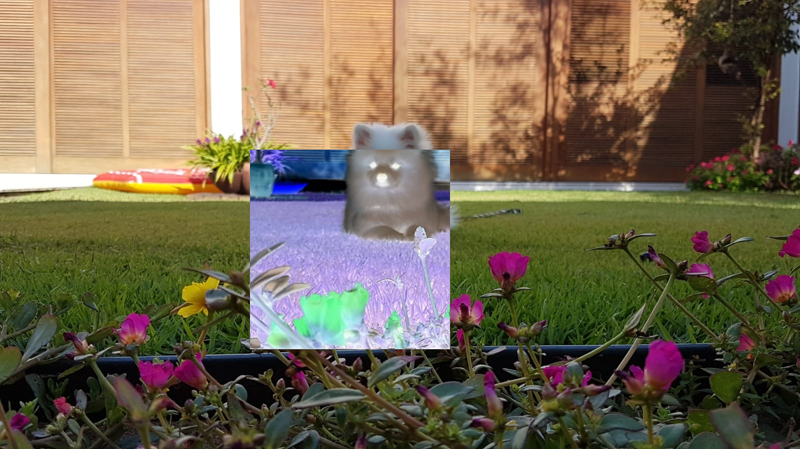
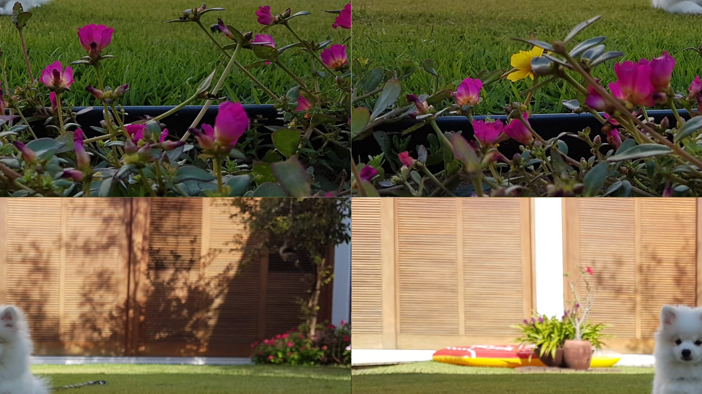
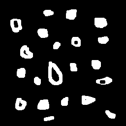
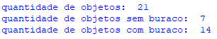
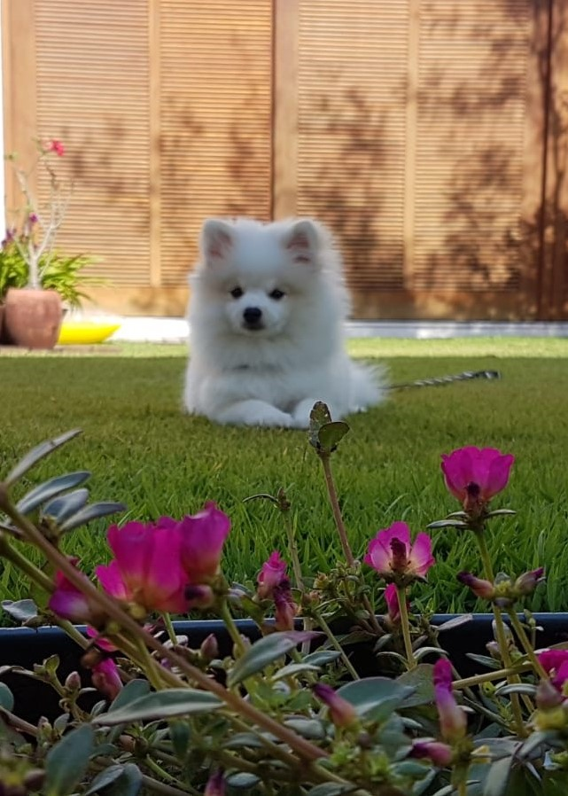
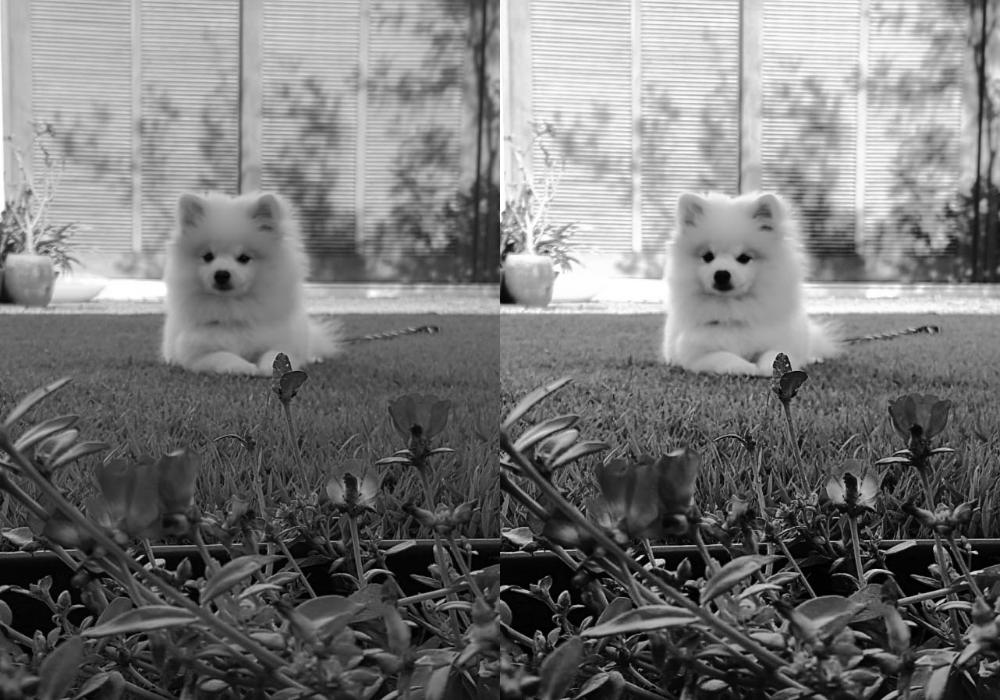
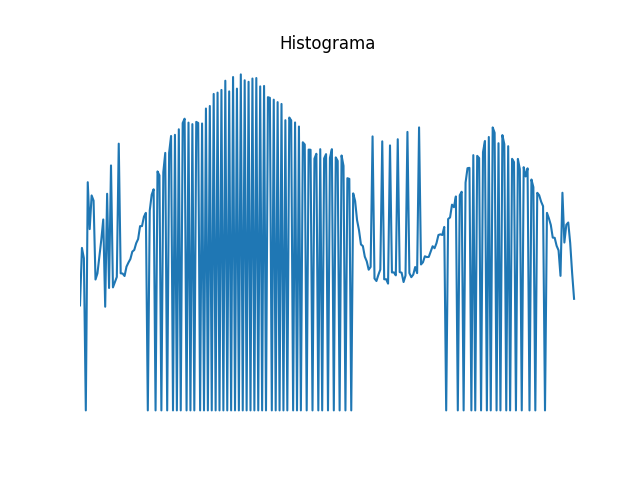
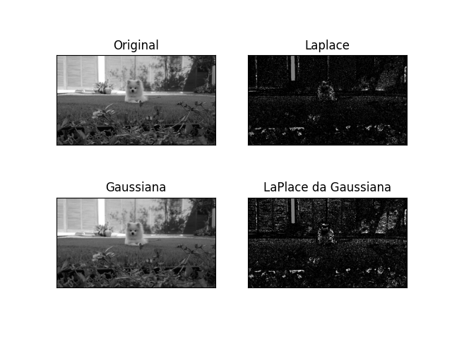

<html lang="pr-br">
<head>
</head>
<body>
<h1>Processamento Digital de Imagens</h1>

Aluno: Lucas da Cunha Lima Vale

<h2>Atividade 1 - Negativo e Trocar Regiões na diagonal</h2>
<h3>1.1 - Negativo</h3>

Utilizando a ideia apresentada pelo professor para o exercicio  
Imagem utilizada: 
 
Imagem de saída do programa: 
 
Código Utilizado: 
<pre class="prettyprint">
<code>
import cv2 as cv
import sys
import numpy as np
img = cv.imread("jordan.jpeg", cv.IMREAD_COLOR)
if img is None:
    sys.exit("Could not read the image.")
img[300:700, 500:900] = 255-img[300:700, 500:900]
cv.imshow("Negativo", img)
cv.imwrite("negativo.jpeg", img)
</code>
</pre>

<h3>1.2 - Trocar Regiões na Diagonal</h3>

Para essa parte da atividade fora a mesma imagem do item 1.1. 
Nesse caso a saída do programa foi: 
 
Código Utilizado: 
<pre class="prettyprint">
<code>
import cv2 as cv
import sys
import numpy as np
img = cv.imread(cv.samples.findFile("jordan.jpeg"))
if img2 is None:
    sys.exit("Could not read the image.")
print('Largura em pixels: ', end='')  
print(img.shape[1]) #largura da imagem
l=img.shape[1]
print('Altura em pixels: ', end='')  
print(img.shape[0]) #altura da imagem
a=img.shape[0]
print('Qtde de canais: ', end='')  
print(img.shape[2])
img2=img.copy()
ma=800
ml=450
for x in range(0,a):
    for y in range(0,l):
        if x<ml and y<ma:
            img2[x, y]=img[x+ml, y+ma]
        if x<ml and y>ma:
            img2[x, y]=img[x+ml, y-ma]
        if x>ml and y<ma:
            img2[x, y]=img[x-ml, y+ma]
        if x>ml and y>ma:
            img2[x, y]=img[x-ml, y-ma]
cv.imshow("cachorrotrocado", img2)
cv.imwrite("jordantrocado.png", img2)
</code>
</pre>

<h2>Atividade 2 - Detector de Objetos</h2>
<h3>2.1 - Detector</h3>

Para resolvermos o problema da contagem de objetos que seja acima de 255 podemos colocar um contador que conte quantas vezes o contador atual atingiu o 255, toda vez que atingir o 255 zera este contador, zerar o contador enquanto que armazenamos no número de vezes que ele chegou ao valor de 255, no final do laço somaríamos mais assim o contador que conta as vezes que o contador inicial chega até 255 multiplicado por 255 mais o valor do contador inicial daria o total de objetos na imagem. 
Utilizando a ideia apresentada pelo professor: 
Imagem de entrada: 
 
Imagem sem objetos na borda: 
 
Contagem: 
 
Código Utilizado: 
<pre class="prettyprint">
<code>
import cv2 as cv
import sys
import numpy as np
img = cv.imread(cv.samples.findFile("bolhas.png"))
if img is None:
    sys.exit("Could not read the image.")
imgflood = img.copy()
print('Largura em pixels: ', end='')  
print(img.shape[1]) #largura da imagem
l=img.shape[1]
print('Altura em pixels: ', end='')  
print(img.shape[0]) #altura da imagem
a=img.shape[0]
print('Qtde de canais: ', end='')  
print(img.shape[2])
mask = np.zeros((a+2, l+2), np.uint8)
c=0
cb=0
for x in range (0, a):
    cv.floodFill(imgflood, mask, (0,x), (0, 0, 0))
    cv.floodFill(imgflood, mask, (x,0), (0, 0, 0))
    cv.floodFill(imgflood, mask, (a-1,x), (0, 0, 0))
    cv.floodFill(imgflood, mask, (x,a-1), (0, 0, 0))
cv.imwrite("bolhas2.png", imgflood)
img=imgflood.copy()
for x in  range (0, a-1):
    for y in range (0, l-1):
       if imgflood[x, y, 2]==255:
            c+=1
            cv.floodFill(imgflood, mask, (y, x), (0, 0, 0))
cv.floodFill(img,None, (0, 0), (255, 255, 255));
cv.imshow("Display window", img)
cv.imwrite("bolhasvazias.png", img)
for x in  range (0, a-1):
    for y in range (0, l-1):
       if img[x, y, 2]==0:
            cb+=1
            cv.floodFill(img, mask, (y, x), (255, 255, 255))
print ('quantidade de objetos: ' ,c)
print ('quantidade de objetos sem buraco: ' ,cb)
print ('quantidade de objetos com buraco: ' ,c-cb)
cv.imwrite("bolhas3.png", imgflood)
</code>
</pre>

<h2>Atividade 3 - Equalizador de Histograma</h2>	

Utilizando a ideia apresentada pelo professor: 
Imagem utilizada: 
 
Imagem de saída do programa em escala de cinza a esquerda sem equalização e a direita com equalização: 
 
Histograma: 
 
Código utilizado: 
<pre class="prettyprint">
<code>
import sys
import numpy as np
from matplotlib import pyplot as plt
img = cv.imread(cv.samples.findFile("jordan3.jpeg"))
if img is None:
    sys.exit("Could not read the image.")
print('Largura em pixels: ', end='')  
print(img.shape[1]) #largura da imagem
l=img.shape[1]
print('Altura em pixels: ', end='')  
print(img.shape[0]) #altura da imagem
a=img.shape[0]
print('Qtde de canais: ', end='')  
print(img.shape[2])
img = cv.cvtColor(img, cv.COLOR_BGR2GRAY)
hist = cv.calcHist([img], [0], None, [256], [0, 256])
equ = cv.equalizeHist(img)
res = np.hstack((img,equ))
hist2 = cv.calcHist([equ], [0], None, [256], [0, 256])
hist2 /= hist2.sum()
plt.figure()
plt.axis("off")
#plt.imshow(cv.cvtColor(img, cv.COLOR_GRAY2RGB))
# plot the histogram
#plt.figure()
plt.title("Histograma")
#plt.plot(hist)
plt.xlim([0, 256])
plt.plot(hist2)
plt.xlim([0, 256])
cv.imshow("Display window", res)
cv.imwrite("cachorros.png", res)
plt.show()
</code>
</pre>

<h2>Atividade 4 - Laplaciano do Gaussiano</h2>	

Utilizando a ideia apresentada pelo professor: 
Imagens obtidas: 
 
Código utilizado: 
<pre class="prettyprint">
<code>
import numpy as np
import cv2 as cv
from matplotlib import pyplot as plt
img = cv.imread('jordan.jpeg',0)
laplacian = cv.Laplacian(img,cv.CV_16S,ksize=19)
blur = cv.GaussianBlur(img,(9,9),0)
laplacegauss = cv.Laplacian(blur,cv.CV_16S,ksize=19)
plt.subplot(2,2,1),plt.imshow(img,cmap = 'gray')
plt.title('Original'), plt.xticks([]), plt.yticks([])
plt.subplot(2,2,2),plt.imshow(laplacian,cmap = 'gray')
plt.title('Laplace'), plt.xticks([]), plt.yticks([])
plt.subplot(2,2,3),plt.imshow(blur,cmap = 'gray')
plt.title('Gaussiana'), plt.xticks([]), plt.yticks([])
plt.subplot(2,2,4),plt.imshow(laplacegauss,cmap = 'gray')
plt.title('LaPlace da Gaussiana'), plt.xticks([]), plt.yticks([])
plt.show()
</code>
</pre>

</body>
</html>
